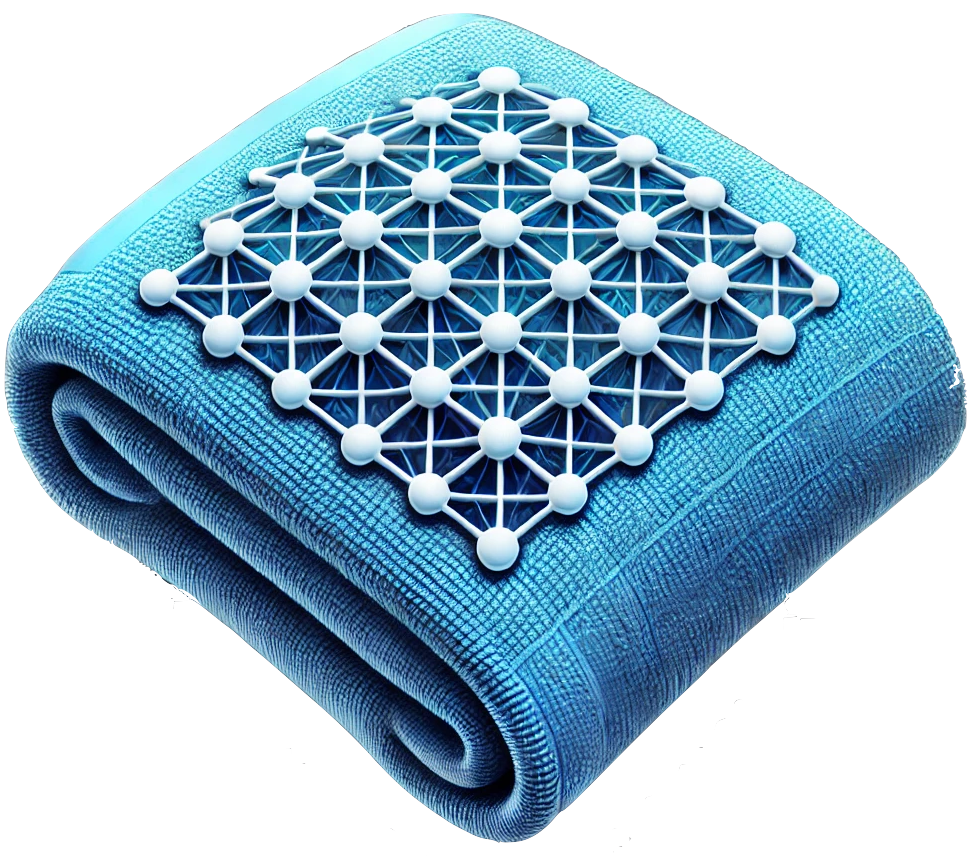

> _"a **towel** is about the most massively useful thing an interstellar AI hitchhiker can have" 
> -- Douglas Adams_

# towel 

compose LLM python functions into dynamic, self-modifying plans

### plan it like you mean it!
- more powerful than chains, simpler than graphs
- self-modifying plans (plans that make plans)
- simple vocabulary: "`step`", "`route`" and "`pin`" for any plan
- mind maps: each step can have its very own LLM
- dynamic routing based on pure functions and step results

### functions over objects
- function compose.. into elegant workflows
- any function can become an LLM: just wrap it in a `@towel`

### function calling / tool use
- one interface for local models and cloud models
- it's great, it's [pydantic](https://github.com/pydantic/pydantic)

### strong LLM response typing
- it's great, it's pydantic
- built-in support for the [instructor](https://github.com/jxnl/instructor) library, enabling structured outputs
- "[DeepThought](https://github.com/tolitius/towel/blob/6caa70312a3715da7adae89149d6d1ab684a2c37/src/towel/brain/base.py#L8-L23)" full with thoughts for non instructor responses

### thread safety
- dynamic `@towel` context handling
- modify context at runtime "`with intel(llm=llm)`"

### multi-model support
- one "`thinker`" API for all
- switch between different LLM providers (Claude, Ollama, etc.)
- extensible to support additional providers via "[Brain](https://github.com/tolitius/towel/blob/6caa70312a3715da7adae89149d6d1ab684a2c37/src/towel/brain/base.py#L25)"

### local models love
- feature parity with cloud models via Ollama integration

# license

Copyright © 2024 tolitius

Distributed under the Eclipse Public License either version 1.0 or (at
your option) any later version.
