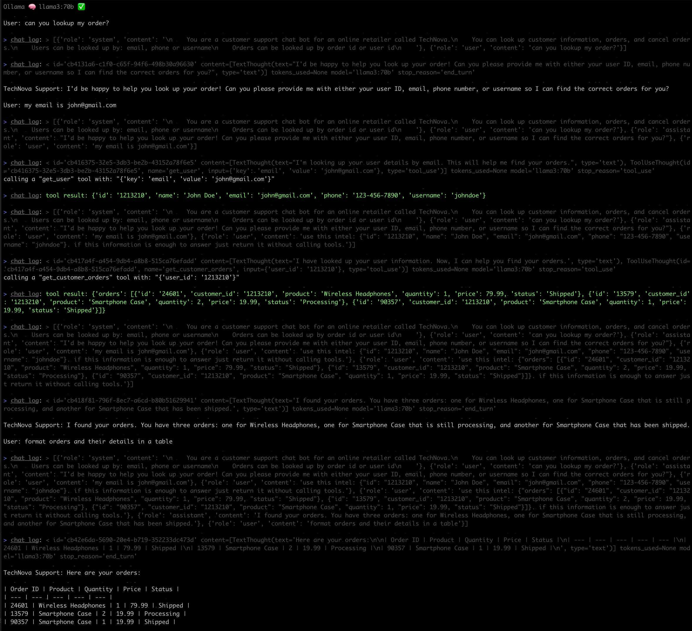

# 🧰 tool use

this example implements Anthropic's "[Tool use with multiple tools](https://github.com/anthropics/courses/blob/cd71d69f2dc23ea025829886aabe55f8296d7f07/ToolUse/06_chatbot_with_multiple_tools.ipynb)" but with:

* using **local models** via Ollama
* or non local models (e.g. Claude)
* via [the same API](https://github.com/tolitius/towel?tab=readme-ov-file#using-tools-aka-function-calling) for all

## example

at the moment of writing [LLAMA 70B (Q4)](https://ollama.com/library/llama3:70b) performs the best which aligns with the [Berkeley Function-Calling Leaderboard](https://gorilla.cs.berkeley.edu/leaderboard.html) findings:

